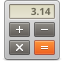

# Calculator

## inherite from
[abcdesktopio/oc.template.gtk.elementary](abcdesktopio/oc.template.gtk.elementary.md)
## use ubuntu package
pantheon-calculator
## Display name
"Calculator"
## path
"/usr/bin/io.elementary.calculator"
## Mount Home volume
"False"
