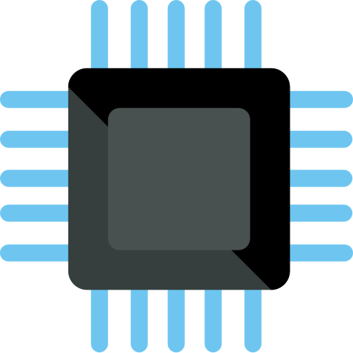

# Application list
This array describe the application list ready to use with abcdesktop.

|icon|displayname|comment|description|json file|
|----|-----------|-------|-----------|---------|
|{: style="height:32px;width:32px"}|2048 (alpine gtk)|Obtain the 2048 tile|[2048-alpine.3.0.md](../2048-alpine)|[2048-alpine.d.3.0.json](../2048-alpine.d.3.0.json)|
|{: style="height:32px;width:32px"}|2048 (ubuntu qt)|The 2048 number game implemented in Qt|[2048-ubuntu.3.0.md](../2048-ubuntu)|[2048-ubuntu.d.3.0.json](../2048-ubuntu.d.3.0.json)|
|{: style="height:32px;width:32px"}|Apache Directory Studio|no comment|[apachedirectorystudio.3.0.md](../apachedirectorystudio)|[apachedirectorystudio.d.3.0.json](../apachedirectorystudio.d.3.0.json)|
|{: style="height:32px;width:32px"}|astromenace|hardcore 3D space shooter with spaceship upgrade possibilities|[astromenace.3.0.md](../astromenace)|[astromenace.d.3.0.json](../astromenace.d.3.0.json)|
|{: style="height:32px;width:32px"}|Base|Manage databases, create queries and reports to track and manage your information by using Base.|[base.3.0.md](../base)|[base.d.3.0.json](../base.d.3.0.json)|
|{: style="height:32px;width:32px"}|Beekeeper-studio|An easy-to use SQL query editor and database UI for Mac, Windows, and Linux|[beekeeperstudio.3.0.md](../beekeeperstudio)|[beekeeperstudio.d.3.0.json](../beekeeperstudio.d.3.0.json)|
|{: style="height:32px;width:32px"}|Blender|3D modeling, animation, rendering and post-production|[blender.3.0.md](../blender)|[blender.d.3.0.json](../blender.d.3.0.json)|
|{: style="height:32px;width:32px"}|Bless|Edit binary files|[bless.3.0.md](../bless)|[bless.d.3.0.json](../bless.d.3.0.json)|
|{: style="height:32px;width:32px"}|blobby|no comment|[blobby.3.0.md](../blobby)|[blobby.d.3.0.json](../blobby.d.3.0.json)|
|{: style="height:32px;width:32px"}|Gnome-boxes|View and use virtual machines|[boxes.3.0.md](../boxes)|[boxes.d.3.0.json](../boxes.d.3.0.json)|
|{: style="height:32px;width:32px"}|calculator|Perform arithmetic, scientific or financial calculations|[calculator.3.0.md](../calculator)|[calculator.d.3.0.json](../calculator.d.3.0.json)|
|{: style="height:32px;width:32px"}|chess|Play the classic two-player board game of chess|[chess.3.0.md](../chess)|[chess.d.3.0.json](../chess.d.3.0.json)|
|{: style="height:32px;width:32px"}|Chrome|Access the Internet|[chrome.3.0.md](../chrome)|[chrome.d.3.0.json](../chrome.d.3.0.json)|
|{: style="height:32px;width:32px"}|chromium (alpine)|no comment|[chromium.3.0.md](../chromium)|[chromium.d.3.0.json](../chromium.d.3.0.json)|
|{: style="height:32px;width:32px"}|Cloud Foundry cli|no comment|[cloudfoundry.3.0.md](../cloudfoundry)|[cloudfoundry.d.3.0.json](../cloudfoundry.d.3.0.json)|
|{: style="height:32px;width:32px"}|cmd.exe wine (alpine)|no comment|[cmd.exe.3.0.md](../cmd.exe)|[cmd.exe.d.3.0.json](../cmd.exe.d.3.0.json)|
|{: style="height:32px;width:32px"}|corsix-th|Open source clone of Theme Hospital|[corsix-th.3.0.md](../corsix-th)|[corsix-th.d.3.0.json](../corsix-th.d.3.0.json)|
|{: style="height:32px;width:32px"}|cuda|Command line access|[cuda.3.0.md](../cuda)|[cuda.d.3.0.json](../cuda.d.3.0.json)|
|{: style="height:32px;width:32px"}|cuda demo suite|no comment|[cudademosuite.3.0.md](../cudademosuite)|[cudademosuite.d.3.0.json](../cudademosuite.d.3.0.json)|
|{: style="height:32px;width:32px"}|Dia|Edit your Diagrams|[dia.3.0.md](../dia)|[dia.d.3.0.json](../dia.d.3.0.json)|
|{: style="height:32px;width:32px"}|Doom|no comment|[doom.3.0.md](../doom)|[doom.d.3.0.json](../doom.d.3.0.json)|
|{: style="height:32px;width:32px"}|Draw|Create and edit drawings, flow charts and logos by using Draw.|[draw.3.0.md](../draw)|[draw.d.3.0.json](../draw.d.3.0.json)|
|{: style="height:32px;width:32px"}|draw.io|draw.io desktop|[drawio.3.0.md](../drawio)|[drawio.d.3.0.json](../drawio.d.3.0.json)|
|{: style="height:32px;width:32px"}|Microsoft Edge|Access the Internet|[edge.3.0.md](../edge)|[edge.d.3.0.json](../edge.d.3.0.json)|
|{: style="height:32px;width:32px"}|eog|Browse and rotate images|[eog.3.0.md](../eog)|[eog.d.3.0.json](../eog.d.3.0.json)|
|{: style="height:32px;width:32px"}|Evince|View multi-page documents|[evince.3.0.md](../evince)|[evince.d.3.0.json](../evince.d.3.0.json)|
|{: style="height:32px;width:32px"}|Evolution|Manage your email, contacts and schedule|[evolution.3.0.md](../evolution)|[evolution.d.3.0.json](../evolution.d.3.0.json)|
|{: style="height:32px;width:32px"}|file-roller|Create and modify an archive|[file-roller.3.0.md](../file-roller)|[file-roller.d.3.0.json](../file-roller.d.3.0.json)|
|{: style="height:32px;width:32px"}|Filelight|View disk usage information|[filelight.3.0.md](../filelight)|[filelight.d.3.0.json](../filelight.d.3.0.json)|
|{: style="height:32px;width:32px"}|filezilla (alpine)|Download and upload files via FTP, FTPS and SFTP|[filezilla.3.0.md](../filezilla)|[filezilla.d.3.0.json](../filezilla.d.3.0.json)|
|{: style="height:32px;width:32px"}|Firefox (esr alpine)|Browse the World Wide Web|[firefox-esr.3.0.md](../firefox-esr)|[firefox-esr.d.3.0.json](../firefox-esr.d.3.0.json)|
|{: style="height:32px;width:32px"}|Firefox (alpine)|Browse the World Wide Web|[firefox.3.0.md](../firefox)|[firefox.d.3.0.json](../firefox.d.3.0.json)|
|{: style="height:32px;width:32px"}|flare|A single player, 2D-isometric, action Role-Playing Game|[flare.3.0.md](../flare)|[flare.d.3.0.json](../flare.d.3.0.json)|
|{: style="height:32px;width:32px"}|frozen-bubble|no comment|[frozen-bubble.3.0.md](../frozen-bubble)|[frozen-bubble.d.3.0.json](../frozen-bubble.d.3.0.json)|
|{: style="height:32px;width:32px"}|GCompris|no comment|[gcompris.3.0.md](../gcompris)|[gcompris.d.3.0.json](../gcompris.d.3.0.json)|
|{: style="height:32px;width:32px"}|Geany|A fast and lightweight IDE using GTK+|[geany.3.0.md](../geany)|[geany.d.3.0.json](../geany.d.3.0.json)|
|{: style="height:32px;width:32px"}|Gedit|no comment|[gedit.3.0.md](../gedit)|[gedit.d.3.0.json](../gedit.d.3.0.json)|
|{: style="height:32px;width:32px"}|gElemental|View the periodic table of elements|[gelemental.3.0.md](../gelemental)|[gelemental.d.3.0.json](../gelemental.d.3.0.json)|
|{: style="height:32px;width:32px"}|Geogebra|no comment|[geogebra.3.0.md](../geogebra)|[geogebra.d.3.0.json](../geogebra.d.3.0.json)|
|{: style="height:32px;width:32px"}|Gimp|Create images and edit photographs|[gimp.3.0.md](../gimp)|[gimp.d.3.0.json](../gimp.d.3.0.json)|
|{: style="height:32px;width:32px"}|Gnumerix (alpine)|Calculation, Analysis, and Visualization of Information|[gnumeric.3.0.md](../gnumeric)|[gnumeric.d.3.0.json](../gnumeric.d.3.0.json)|
|{: style="height:32px;width:32px"}|Golly|no comment|[golly.3.0.md](../golly)|[golly.d.3.0.json](../golly.d.3.0.json)|
|{: style="height:32px;width:32px"}|hyper|A terminal built on web technologies|[hyper.3.0.md](../hyper)|[hyper.d.3.0.json](../hyper.d.3.0.json)|
|{: style="height:32px;width:32px"}|Impress|Create and edit presentations for slideshows, meeting and Web pages by using Impress.|[impress.3.0.md](../impress)|[impress.d.3.0.json](../impress.d.3.0.json)|
|{: style="height:32px;width:32px"}|inkscape|Create and edit Scalable Vector Graphics images|[inkscape.3.0.md](../inkscape)|[inkscape.d.3.0.json](../inkscape.d.3.0.json)|
|{: style="height:32px;width:32px"}|Kalzium|KDE Periodic Table of Elements|[kalzium.3.0.md](../kalzium)|[kalzium.d.3.0.json](../kalzium.d.3.0.json)|
|{: style="height:32px;width:32px"}|kDiamond|no comment|[kdiamond.3.0.md](../kdiamond)|[kdiamond.d.3.0.json](../kdiamond.d.3.0.json)|
|{: style="height:32px;width:32px"}|Kgeography|A Geography Learning Program|[kgeography.3.0.md](../kgeography)|[kgeography.d.3.0.json](../kgeography.d.3.0.json)|
|{: style="height:32px;width:32px"}|kigo|no comment|[kigo.3.0.md](../kigo)|[kigo.d.3.0.json](../kigo.d.3.0.json)|
|{: style="height:32px;width:32px"}|Klickety|no comment|[klickety.3.0.md](../klickety)|[klickety.d.3.0.json](../klickety.d.3.0.json)|
|{: style="height:32px;width:32px"}|klotski|no comment|[klotski.3.0.md](../klotski)|[klotski.d.3.0.json](../klotski.d.3.0.json)|
|{: style="height:32px;width:32px"}|konsole|no comment|[konsole.3.0.md](../konsole)|[konsole.d.3.0.json](../konsole.d.3.0.json)|
|{: style="height:32px;width:32px"}|konsole [ephemeral_container]|no comment|[konsolephemeralcontainer.3.0.md](../konsolephemeralcontainer)|[konsolephemeralcontainer.d.3.0.json](../konsolephemeralcontainer.d.3.0.json)|
|{: style="height:32px;width:32px"}|konsole [pod]|no comment|[konsolepod.3.0.md](../konsolepod)|[konsolepod.d.3.0.json](../konsolepod.d.3.0.json)|
|{: style="height:32px;width:32px"}|konsole bronze [pod]|no comment|[konsolepodbronze.3.0.md](../konsolepodbronze)|[konsolepodbronze.d.3.0.json](../konsolepodbronze.d.3.0.json)|
|{: style="height:32px;width:32px"}|konsole gold [pod]|no comment|[konsolepodgold.3.0.md](../konsolepodgold)|[konsolepodgold.d.3.0.json](../konsolepodgold.d.3.0.json)|
|{: style="height:32px;width:32px"}|konsole silver [pod]|no comment|[konsolepodsilver.3.0.md](../konsolepodsilver)|[konsolepodsilver.d.3.0.json](../konsolepodsilver.d.3.0.json)|
|{: style="height:32px;width:32px"}|kSquares|no comment|[ksquares.3.0.md](../ksquares)|[ksquares.d.3.0.json](../ksquares.d.3.0.json)|
|{: style="height:32px;width:32px"}|kTurtle|Educational Programming Environment|[kturtle.3.0.md](../kturtle)|[kturtle.d.3.0.json](../kturtle.d.3.0.json)|
|{: style="height:32px;width:32px"}|Leocad|no comment|[leocad.3.0.md](../leocad)|[leocad.d.3.0.json](../leocad.d.3.0.json)|
|{: style="height:32px;width:32px"}|LibreCAD|no comment|[librecad.3.0.md](../librecad)|[librecad.d.3.0.json](../librecad.d.3.0.json)|
|{: style="height:32px;width:32px"}|mahjongg|no comment|[mahjongg.3.0.md](../mahjongg)|[mahjongg.d.3.0.json](../mahjongg.d.3.0.json)|
|{: style="height:32px;width:32px"}|maps|A simple maps application|[maps.3.0.md](../maps)|[maps.d.3.0.json](../maps.d.3.0.json)|
|{: style="height:32px;width:32px"}|Math|Create and edit scientific formulas and equations by using Math.|[math.3.0.md](../math)|[math.d.3.0.json](../math.d.3.0.json)|
|{: style="height:32px;width:32px"}|minecraft|Official Minecraft Launcher|[minecraft.3.0.md](../minecraft)|[minecraft.d.3.0.json](../minecraft.d.3.0.json)|
|{: style="height:32px;width:32px"}|gnome-mines (alpine)|Clear hidden mines from a minefield|[mines.3.0.md](../mines)|[mines.d.3.0.json](../mines.d.3.0.json)|
|{: style="height:32px;width:32px"}|Mongodb Compass|The MongoDB GUI|[mongodb-compass.3.0.md](../mongodb-compass)|[mongodb-compass.d.3.0.json](../mongodb-compass.d.3.0.json)|
|{: style="height:32px;width:32px"}|FileManager|Access and organize files|[nautilus.3.0.md](../nautilus)|[nautilus.d.3.0.json](../nautilus.d.3.0.json)|
|{: style="height:32px;width:32px"}|Notepad Wine (alpine)|no comment|[notepad-wine.3.0.md](../notepad-wine)|[notepad-wine.d.3.0.json](../notepad-wine.d.3.0.json)|
|{: style="height:32px;width:32px"}|notepadqq|Edit source code files|[notepadqq.3.0.md](../notepadqq)|[notepadqq.d.3.0.json](../notepadqq.d.3.0.json)|
|{: style="height:32px;width:32px"}|octave|no comment|[octave.3.0.md](../octave)|[octave.d.3.0.json](../octave.d.3.0.json)|
|{: style="height:32px;width:32px"}|Pinta (alpine)|Easily create and edit images|[pinta.3.0.md](../pinta)|[pinta.d.3.0.json](../pinta.d.3.0.json)|
|{: style="height:32px;width:32px"}|Planner|no comment|[planner.3.0.md](../planner)|[planner.d.3.0.json](../planner.d.3.0.json)|
|{: style="height:32px;width:32px"}|Postman|no comment|[postman.3.0.md](../postman)|[postman.d.3.0.json](../postman.d.3.0.json)|
|{: style="height:32px;width:32px"}|Powershell|no comment|[powershell.3.0.md](../powershell)|[powershell.d.3.0.json](../powershell.d.3.0.json)|
|{: style="height:32px;width:32px"}|Putty Unix|no comment|[putty-unix.3.0.md](../putty-unix)|[putty-unix.d.3.0.json](../putty-unix.d.3.0.json)|
|{: style="height:32px;width:32px"}|Putty Wine (alpine)|no comment|[putty-wine.3.0.md](../putty-wine)|[putty-wine.d.3.0.json](../putty-wine.d.3.0.json)|
|{: style="height:32px;width:32px"}|qterminal [Pod]|Terminal emulator|[qterminalpod.3.0.md](../qterminalpod)|[qterminalpod.d.3.0.json](../qterminalpod.d.3.0.json)|
|{: style="height:32px;width:32px"}|Remarkable|A free, fully featured markdown editor for Linux.|[remarkable.3.0.md](../remarkable)|[remarkable.d.3.0.json](../remarkable.d.3.0.json)|
|{: style="height:32px;width:32px"}|Remmina|Access remote desktops with Remmina|[remmina.3.0.md](../remmina)|[remmina.d.3.0.json](../remmina.d.3.0.json)|
|{: style="height:32px;width:32px"}|rhythmbox|Play and organize your music collection|[rhythmbox.3.0.md](../rhythmbox)|[rhythmbox.d.3.0.json](../rhythmbox.d.3.0.json)|
|{: style="height:32px;width:32px"}|Robots|no comment|[robots.3.0.md](../robots)|[robots.d.3.0.json](../robots.d.3.0.json)|
|{: style="height:32px;width:32px"}|Shotcut|Shotcut is a free, open source, cross-platform video editor.|[shotcut.3.0.md](../shotcut)|[shotcut.d.3.0.json](../shotcut.d.3.0.json)|
|{: style="height:32px;width:32px"}|Stellarium|Planetarium|[stellarium.3.0.md](../stellarium)|[stellarium.d.3.0.json](../stellarium.d.3.0.json)|
|{: style="height:32px;width:32px"}|Step|Simulate physics experiments|[step.3.0.md](../step)|[step.d.3.0.json](../step.d.3.0.json)|
|{: style="height:32px;width:32px"}|stress|Command line access|[stress.3.0.md](../stress)|[stress.d.3.0.json](../stress.d.3.0.json)|
|{: style="height:32px;width:32px"}|sublime-Text|Sophisticated text editor for code, markup and prose|[sublime-text.3.0.md](../sublime-text)|[sublime-text.d.3.0.json](../sublime-text.d.3.0.json)|
|{: style="height:32px;width:32px"}|sudoku|Test your logic skills in this number grid puzzle|[sudoku.3.0.md](../sudoku)|[sudoku.d.3.0.json](../sudoku.d.3.0.json)|
|{: style="height:32px;width:32px"}|supertux2|Play a classic 2D platform game|[supertux2.3.0.md](../supertux2)|[supertux2.d.3.0.json](../supertux2.d.3.0.json)|
|{: style="height:32px;width:32px"}|swell-foop|Clear the screen by removing groups of colored and shaped tiles|[swell-foop.3.0.md](../swell-foop)|[swell-foop.d.3.0.json](../swell-foop.d.3.0.json)|
|{: style="height:32px;width:32px"}|taquin|Slide tiles to their correct places|[taquin.3.0.md](../taquin)|[taquin.d.3.0.json](../taquin.d.3.0.json)|
|{: style="height:32px;width:32px"}|Terminal sudo|Command line access|[terminal.3.0.md](../terminal)|[terminal.d.3.0.json](../terminal.d.3.0.json)|
|{: style="height:32px;width:32px"}|Terminal [ephemeral container]|no comment|[terminalephemeral.3.0.md](../terminalephemeral)|[terminalephemeral.d.3.0.json](../terminalephemeral.d.3.0.json)|
|{: style="height:32px;width:32px"}|Tetravex|no comment|[tetravex.3.0.md](../tetravex)|[tetravex.d.3.0.json](../tetravex.d.3.0.json)|
|{: style="height:32px;width:32px"}|Thunderbird|Send and receive mail with Thunderbird|[thunderbird.3.0.md](../thunderbird)|[thunderbird.d.3.0.json](../thunderbird.d.3.0.json)|
|{: style="height:32px;width:32px"}|Commodore64||[vice.3.0.md](../vice)|[vice.d.3.0.json](../vice.d.3.0.json)|
|{: style="height:32px;width:32px"}|videolan|Read, capture, broadcast your multimedia streams|[vlc.3.0.md](../vlc)|[vlc.d.3.0.json](../vlc.d.3.0.json)|
|{: style="height:32px;width:32px"}|VSCode|Code Editing. Redefined.|[vscode.3.0.md](../vscode)|[vscode.d.3.0.json](../vscode.d.3.0.json)|
|{: style="height:32px;width:32px"}|weather|Show weather conditions and forecast|[weather.3.0.md](../weather)|[weather.d.3.0.json](../weather.d.3.0.json)|
|{: style="height:32px;width:32px"}|whatsdesk|unofficial whatsapp client for linux |[whatsdesk.3.0.md](../whatsdesk)|[whatsdesk.d.3.0.json](../whatsdesk.d.3.0.json)|
|{: style="height:32px;width:32px"}|Winefile Wine (alpine)|no comment|[winefile-wine.3.0.md](../winefile-wine)|[winefile-wine.d.3.0.json](../winefile-wine.d.3.0.json)|
|{: style="height:32px;width:32px"}|WineMine Wine (alpine)|no comment|[winemine-wine.3.0.md](../winemine-wine)|[winemine-wine.d.3.0.json](../winemine-wine.d.3.0.json)|
|{: style="height:32px;width:32px"}|Winhelp Wine|no comment|[winhelp-wine.3.0.md](../winhelp-wine)|[winhelp-wine.d.3.0.json](../winhelp-wine.d.3.0.json)|
|{: style="height:32px;width:32px"}|WinSCP|no comment|[winscp-wine.3.0.md](../winscp-wine)|[winscp-wine.d.3.0.json](../winscp-wine.d.3.0.json)|
|{: style="height:32px;width:32px"}|wireshark (alpine)|Network traffic analyzer|[wireshark.3.0.md](../wireshark)|[wireshark.d.3.0.json](../wireshark.d.3.0.json)|
|{: style="height:32px;width:32px"}|Writer alpine|Create and edit text and graphics in letters, reports, documents and Web pages by using Writer.|[writer.3.0.md](../writer)|[writer.d.3.0.json](../writer.d.3.0.json)|
|{: style="height:32px;width:32px"}|Xclock|no comment|[xclock.3.0.md](../xclock)|[xclock.d.3.0.json](../xclock.d.3.0.json)|
|{: style="height:32px;width:32px"}|Xedit|no comment|[xedit.3.0.md](../xedit)|[xedit.d.3.0.json](../xedit.d.3.0.json)|
|{: style="height:32px;width:32px"}|xeyes|no comment|[xeyes.3.0.md](../xeyes)|[xeyes.d.3.0.json](../xeyes.d.3.0.json)|
|{: style="height:32px;width:32px"}|Xman|no comment|[xman.3.0.md](../xman)|[xman.d.3.0.json](../xman.d.3.0.json)|
|{: style="height:32px;width:32px"}|Xpad|Jot down notes for later|[xpad.3.0.md](../xpad)|[xpad.d.3.0.json](../xpad.d.3.0.json)|
|{: style="height:32px;width:32px"}|Xterm (sudo)|standard terminal emulator for the X window system|[xterm.3.0.md](../xterm)|[xterm.d.3.0.json](../xterm.d.3.0.json)|
